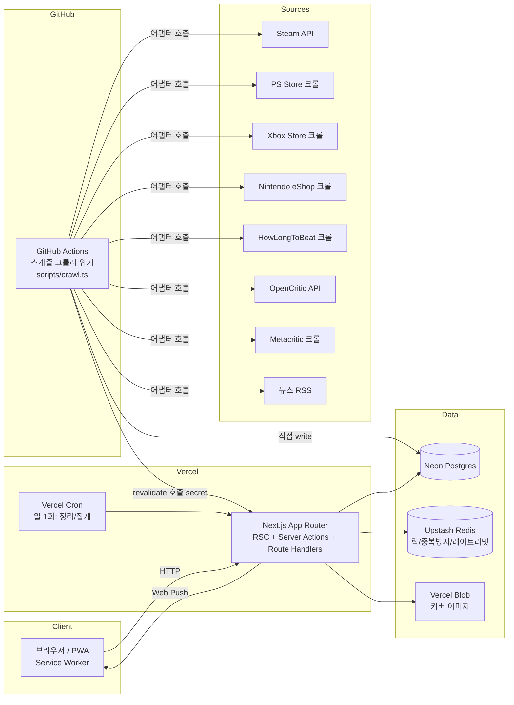
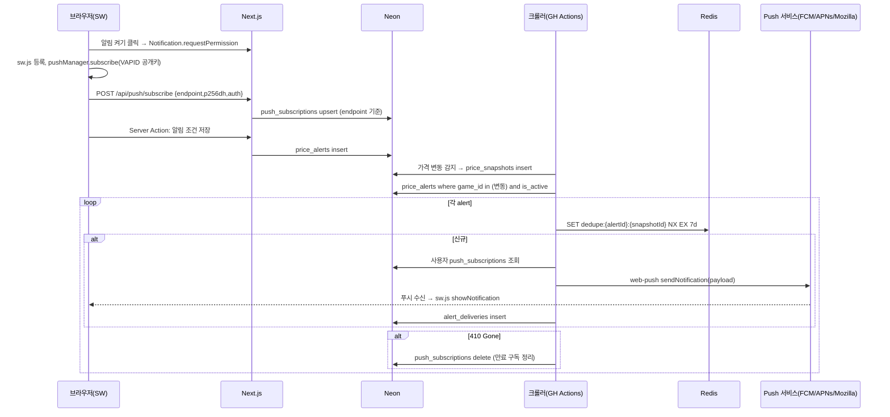

# 손전등 개발 설계서

**문서 목적**: `손전등_기획서_v2.md`를 실제 구현 가능한 구조로 변환한다. MVP 범위를 못 박고, 무료 인프라 한도 안에서 돌아가는 아키텍처를 정의한다.

**전제**
- 스택 확정: Next.js(App Router, TS), Drizzle ORM, Neon Postgres, Clerk, Upstash Redis, Vercel Blob, Vercel Cron + GitHub Actions 크롤러, Vercel 배포
- 커뮤니티·중고거래·포인트제도는 MVP 제외. 스키마 확장 여지만 남김
- Steam 외 소스는 전부 크롤링. 어댑터 패턴 + 갱신시각 노출 필수
- 계층은 route → service → adapter/db 3단계까지만

---

## 1. 시스템 아키텍처



**역할 분리 이유**
- Vercel Hobby 함수는 실행시간 짧고 Cron도 하루 1회·2개 제한(확인 필요). 크롤링을 Vercel 함수에서 돌리면 타임아웃 난다 → **모든 수집은 GitHub Actions에서 실행**, Neon에 직접 쓰고 끝나면 `/api/revalidate` 호출로 Next 캐시 태그 무효화
- Vercel Cron은 가벼운 일 1회 작업만(스냅샷 다운샘플링, 오래된 뉴스 삭제)
- Redis는 MVP에서 세 용도만: 크롤러 실행 락, 알림 발송 중복 방지 키, 푸시 구독 API 레이트리밋. 캐싱은 Next 데이터 캐시(`unstable_cache` + tag)로 충분

---

## 2. 프로젝트 폴더 구조

```
sonjeondeung/
├── src/
│   ├── app/
│   │   ├── (public)/
│   │   │   ├── page.tsx                      # 홈: 검색, 오늘의 할인, 신작
│   │   │   ├── search/page.tsx               # 검색 결과 (searchParams)
│   │   │   └── games/[slug]/
│   │   │       ├── page.tsx                  # 상세 메인 (카드형, 플랫폼 탭)
│   │   │       ├── prices/page.tsx           # 할인 가격 그래프
│   │   │       ├── patches/page.tsx          # 업데이트 노트 (확장1)
│   │   │       ├── editions/page.tsx         # DLC/에디션 비교 (확장1)
│   │   │       └── retro/page.tsx            # 레트로 정보 (확장1)
│   │   ├── (user)/                           # Clerk 로그인 필수
│   │   │   ├── wishlist/page.tsx
│   │   │   ├── alerts/page.tsx
│   │   │   └── settings/page.tsx
│   │   ├── (vendor)/vendor/                  # 게임업체/판매업체 (확장1)
│   │   ├── (admin)/admin/
│   │   │   ├── page.tsx                      # 동기화 상태 대시보드
│   │   │   ├── games/[id]/page.tsx           # 데이터 정정, 소스 매핑
│   │   │   └── sync-logs/page.tsx
│   │   ├── api/
│   │   │   ├── revalidate/route.ts           # 크롤러 완료 → 캐시 태그 무효화
│   │   │   ├── cron/daily/route.ts           # Vercel Cron 진입점
│   │   │   ├── push/subscribe/route.ts       # SW에서 구독 저장
│   │   │   ├── webhooks/clerk/route.ts       # user.created → users 미러
│   │   │   └── v1/games/[slug]/route.ts      # 공개 JSON (추후 앱용)
│   │   ├── layout.tsx
│   │   └── manifest.ts                       # PWA
│   ├── server/
│   │   ├── db/
│   │   │   ├── schema.ts
│   │   │   ├── client.ts                     # neon-http + drizzle
│   │   │   └── migrations/
│   │   ├── services/                         # 비즈니스 로직, route에서 호출
│   │   │   ├── games.ts
│   │   │   ├── prices.ts
│   │   │   ├── wishlist.ts
│   │   │   ├── alerts.ts
│   │   │   └── admin.ts
│   │   ├── adapters/                         # 소스별 수집기
│   │   │   ├── types.ts                      # SourceAdapter 인터페이스
│   │   │   ├── steam.ts
│   │   │   ├── psstore.ts
│   │   │   ├── xbox.ts
│   │   │   ├── nintendo.ts
│   │   │   ├── hltb.ts
│   │   │   ├── opencritic.ts
│   │   │   ├── metacritic.ts
│   │   │   └── news-rss.ts
│   │   ├── sync/                             # 어댑터 결과 → DB 반영
│   │   │   ├── run-source.ts                 # 락, 재시도, 로그
│   │   │   └── match.ts                      # 소스 간 게임 매칭
│   │   ├── push/webpush.ts
│   │   └── redis.ts
│   ├── components/
│   ├── lib/                                  # 순수 유틸 (가격 포맷, slug 등)
│   └── middleware.ts                         # Clerk + role 가드
├── public/sw.js                              # 웹푸시 Service Worker
├── scripts/
│   └── crawl.ts                              # GitHub Actions 진입점: tsx scripts/crawl.ts --source=steam
├── .github/workflows/
│   ├── crawl-prices.yml                      # 4시간 간격
│   ├── crawl-meta.yml                        # 일 1회 (HLTB, 평점)
│   └── crawl-news.yml                        # 1시간 간격
├── drizzle.config.ts
└── vercel.json                               # cron 정의
```

`scripts/crawl.ts`는 `src/server/adapters`, `src/server/sync`를 그대로 import한다. 크롤러 코드가 앱과 한 저장소에 있어 중복 없음.

---

## 3. DB 스키마

### 3.1 테이블 개요

| 테이블 | 용도 | MVP |
|---|---|---|
| `games` | 게임 마스터(제목, 설명, 장르, 멀티플레이) | O |
| `genres`, `game_genres` | 장르 M:N | O |
| `game_platforms` | 플랫폼별 상업 정보(정가/현재가/버전/출시일/점수) | O |
| `price_snapshots` | 가격 이력 (그래프용) | O |
| `game_source_refs` | 소스별 외부 ID 매핑(HLTB, OpenCritic 등) | O |
| `playtimes` | 플레이타임 3종 | O |
| `news` | 게임별 뉴스 (제목+링크+썸네일만) | O |
| `users` | Clerk 미러 + role | O |
| `wishlists` | 찜 | O |
| `push_subscriptions` | 웹푸시 구독 | O |
| `price_alerts` | 알림 조건 | O |
| `alert_deliveries` | 발송 이력(중복 방지) | O |
| `sync_logs` | 소스별 실행 로그 | O |
| `data_corrections` | 관리자 정정 이력 | O(최소) |
| `patch_notes` | 버전별 변경 이력 | 확장1 |
| `game_editions` | DLC/에디션/번들 | 확장1 |
| `retro_info` | 레트로 게임 정보 | 확장1 |
| `game_reviews` | 유저 평점/한줄평 | 확장1 |
| `sellers`, `preorders` | 판매업체, 예판+사은품 | 확장1 |
| `posts`, `listings`, `point_ledger` | 커뮤니티/중고거래/포인트 | 확장2 (미설계) |

### 3.2 Drizzle 스키마 (MVP 핵심)

```ts
// src/server/db/schema.ts
import {
  pgTable, pgEnum, uuid, text, integer, numeric, boolean,
  timestamp, date, jsonb, primaryKey, index, uniqueIndex,
} from "drizzle-orm/pg-core";

export const platformEnum = pgEnum("platform", ["steam", "ps5", "ps4", "xbox", "switch", "switch2"]);
export const sourceEnum = pgEnum("source", ["steam", "psstore", "xbox", "nintendo", "hltb", "opencritic", "metacritic", "rss", "manual"]);
export const roleEnum = pgEnum("role", ["user", "game_company", "seller", "admin"]);
export const syncStatusEnum = pgEnum("sync_status", ["ok", "partial", "failed"]);

export const games = pgTable("games", {
  id: uuid("id").primaryKey().defaultRandom(),
  slug: text("slug").notNull().unique(),
  titleKo: text("title_ko"),
  titleEn: text("title_en").notNull(),
  description: text("description"),
  coverUrl: text("cover_url"),
  developer: text("developer"),
  publisher: text("publisher"),
  // 멀티플레이 정보 — 기획서 3-6
  localMaxPlayers: integer("local_max_players"),
  onlineMaxPlayers: integer("online_max_players"),
  supportsSolo: boolean("supports_solo").default(true),
  supportsCoop: boolean("supports_coop").default(false),
  supportsPvp: boolean("supports_pvp").default(false),
  isRetro: boolean("is_retro").default(false),
  createdAt: timestamp("created_at").defaultNow().notNull(),
  updatedAt: timestamp("updated_at").defaultNow().notNull(),
}, (t) => [index("games_title_en_idx").on(t.titleEn)]);

export const genres = pgTable("genres", {
  id: integer("id").primaryKey().generatedAlwaysAsIdentity(),
  name: text("name").notNull().unique(),
});

export const gameGenres = pgTable("game_genres", {
  gameId: uuid("game_id").references(() => games.id, { onDelete: "cascade" }).notNull(),
  genreId: integer("genre_id").references(() => genres.id).notNull(),
}, (t) => [primaryKey({ columns: [t.gameId, t.genreId] })]);

export const gamePlatforms = pgTable("game_platforms", {
  id: uuid("id").primaryKey().defaultRandom(),
  gameId: uuid("game_id").references(() => games.id, { onDelete: "cascade" }).notNull(),
  platform: platformEnum("platform").notNull(),
  storeExternalId: text("store_external_id"),
  storeUrl: text("store_url"),
  releaseDate: date("release_date"),
  currentVersion: text("current_version"),
  listPrice: integer("list_price"),          // KRW 정수
  currentPrice: integer("current_price"),
  discountPct: integer("discount_pct"),
  metacriticScore: integer("metacritic_score"),
  opencriticScore: integer("opencritic_score"),
  lastSyncedAt: timestamp("last_synced_at"),  // UI "갱신 시각" 표시 원천
  syncStatus: syncStatusEnum("sync_status").default("ok"),
}, (t) => [uniqueIndex("gp_game_platform_uq").on(t.gameId, t.platform)]);

export const priceSnapshots = pgTable("price_snapshots", {
  id: integer("id").primaryKey().generatedAlwaysAsIdentity(),
  gamePlatformId: uuid("game_platform_id").references(() => gamePlatforms.id, { onDelete: "cascade" }).notNull(),
  price: integer("price").notNull(),
  discountPct: integer("discount_pct").default(0),
  capturedAt: timestamp("captured_at").defaultNow().notNull(),
}, (t) => [index("ps_gp_captured_idx").on(t.gamePlatformId, t.capturedAt)]);

export const gameSourceRefs = pgTable("game_source_refs", {
  gameId: uuid("game_id").references(() => games.id, { onDelete: "cascade" }).notNull(),
  source: sourceEnum("source").notNull(),
  externalId: text("external_id").notNull(),
  url: text("url"),
  matchedBy: text("matched_by").notNull(), // "auto" | "manual"
  confidence: numeric("confidence", { precision: 3, scale: 2 }),
}, (t) => [primaryKey({ columns: [t.gameId, t.source] })]);

export const playtimes = pgTable("playtimes", {
  gameId: uuid("game_id").primaryKey().references(() => games.id, { onDelete: "cascade" }),
  mainStoryHours: numeric("main_story_hours", { precision: 5, scale: 1 }),
  mainExtraHours: numeric("main_extra_hours", { precision: 5, scale: 1 }),
  completionistHours: numeric("completionist_hours", { precision: 5, scale: 1 }),
  lastSyncedAt: timestamp("last_synced_at"),
});

export const news = pgTable("news", {
  id: uuid("id").primaryKey().defaultRandom(),
  gameId: uuid("game_id").references(() => games.id, { onDelete: "cascade" }),
  title: text("title").notNull(),
  url: text("url").notNull().unique(),
  sourceName: text("source_name").notNull(),
  thumbnailUrl: text("thumbnail_url"),
  publishedAt: timestamp("published_at").notNull(),
}, (t) => [index("news_game_pub_idx").on(t.gameId, t.publishedAt)]);

export const users = pgTable("users", {
  id: uuid("id").primaryKey().defaultRandom(),
  clerkId: text("clerk_id").notNull().unique(),
  role: roleEnum("role").default("user").notNull(),
  displayName: text("display_name"),
  createdAt: timestamp("created_at").defaultNow().notNull(),
});

export const wishlists = pgTable("wishlists", {
  userId: uuid("user_id").references(() => users.id, { onDelete: "cascade" }).notNull(),
  gameId: uuid("game_id").references(() => games.id, { onDelete: "cascade" }).notNull(),
  createdAt: timestamp("created_at").defaultNow().notNull(),
}, (t) => [primaryKey({ columns: [t.userId, t.gameId] })]);

export const pushSubscriptions = pgTable("push_subscriptions", {
  id: uuid("id").primaryKey().defaultRandom(),
  userId: uuid("user_id").references(() => users.id, { onDelete: "cascade" }).notNull(),
  endpoint: text("endpoint").notNull().unique(),
  p256dh: text("p256dh").notNull(),
  auth: text("auth").notNull(),
  createdAt: timestamp("created_at").defaultNow().notNull(),
});

export const priceAlerts = pgTable("price_alerts", {
  id: uuid("id").primaryKey().defaultRandom(),
  userId: uuid("user_id").references(() => users.id, { onDelete: "cascade" }).notNull(),
  gameId: uuid("game_id").references(() => games.id, { onDelete: "cascade" }).notNull(),
  platform: platformEnum("platform"),          // null = 모든 플랫폼
  minDiscountPct: integer("min_discount_pct").default(1), // 1 = 할인 발생 시
  isActive: boolean("is_active").default(true).notNull(),
}, (t) => [index("pa_game_active_idx").on(t.gameId, t.isActive)]);

export const alertDeliveries = pgTable("alert_deliveries", {
  alertId: uuid("alert_id").references(() => priceAlerts.id, { onDelete: "cascade" }).notNull(),
  snapshotId: integer("snapshot_id").references(() => priceSnapshots.id).notNull(),
  sentAt: timestamp("sent_at").defaultNow().notNull(),
}, (t) => [primaryKey({ columns: [t.alertId, t.snapshotId] })]);

export const syncLogs = pgTable("sync_logs", {
  id: integer("id").primaryKey().generatedAlwaysAsIdentity(),
  source: sourceEnum("source").notNull(),
  status: syncStatusEnum("status").notNull(),
  processed: integer("processed").default(0),
  failed: integer("failed").default(0),
  errorSample: text("error_sample"),
  startedAt: timestamp("started_at").notNull(),
  finishedAt: timestamp("finished_at"),
});

export const dataCorrections = pgTable("data_corrections", {
  id: uuid("id").primaryKey().defaultRandom(),
  adminUserId: uuid("admin_user_id").references(() => users.id).notNull(),
  table: text("table").notNull(),
  rowId: text("row_id").notNull(),
  field: text("field").notNull(),
  before: jsonb("before"),
  after: jsonb("after"),
  lockField: boolean("lock_field").default(true), // true면 크롤러가 덮어쓰지 않음
  createdAt: timestamp("created_at").defaultNow().notNull(),
});
```

### 3.3 확장1 테이블 (컬럼만 정의)

- `patch_notes(id, game_platform_id, version, title, body_md, source_url, published_at)` — 플랫폼별 패치 속도 비교는 `version + published_at` 조인으로 계산
- `game_editions(id, game_id, platform, name, kind[edition|dlc|bundle], price, includes_md, store_url)`
- `retro_info(game_id PK, original_platform, original_release_year, emulation_status, collector_note, market_price_low, market_price_high)`
- `game_reviews(id, user_id, game_id, rating 1~5, body, created_at)` + `games.rating_avg`, `games.rating_count` 집계 컬럼
- `sellers(id, user_id, name, kind[online|offline], url, address, lat, lng)` / `preorders(id, game_id, seller_id, platform, price, bonus_items_md, url, starts_at, ends_at)`

### 3.4 관계 요약

```
games 1─N game_platforms 1─N price_snapshots
games 1─N game_source_refs
games 1─1 playtimes
games N─M genres
games 1─N news
users 1─N wishlists N─1 games
users 1─N push_subscriptions
users 1─N price_alerts N─1 games ; price_alerts 1─N alert_deliveries
```

---

## 4. 데이터 수집 파이프라인

### 4.1 어댑터 인터페이스

구현체가 8개라 인터페이스 정의 정당함. 어댑터는 **가져오기만** 한다. DB 반영은 `sync/`가 맡음.

```ts
// src/server/adapters/types.ts
export type Source = "steam" | "psstore" | "xbox" | "nintendo" | "hltb" | "opencritic" | "metacritic" | "rss";

export interface StoreSnapshot {
  platform: "steam" | "ps5" | "ps4" | "xbox" | "switch" | "switch2";
  storeExternalId: string;
  storeUrl: string;
  listPrice: number | null;      // KRW
  currentPrice: number | null;
  discountPct: number | null;
  currentVersion?: string | null;
  releaseDate?: string | null;   // ISO date
}

export interface MetaSnapshot {
  playtime?: { main: number | null; extra: number | null; completionist: number | null };
  scores?: { metacritic?: number | null; opencritic?: number | null };
  genres?: string[];
  multiplayer?: { localMax?: number; onlineMax?: number; coop?: boolean; pvp?: boolean };
}

export interface SourceAdapter<T extends StoreSnapshot | MetaSnapshot | NewsItem[]> {
  source: Source;
  /** 제목으로 후보 검색 — 매칭 단계용 */
  search(query: string): Promise<Array<{ externalId: string; title: string; url: string }>>;
  /** 외부 ID로 단건 조회 */
  fetch(externalId: string): Promise<T>;
  /** 소스별 요청 간격(ms). 크롤 대상은 보수적으로 */
  minIntervalMs: number;
}

export interface NewsItem { title: string; url: string; sourceName: string; thumbnailUrl?: string; publishedAt: string; }
```

- 스토어 어댑터(steam/psstore/xbox/nintendo) → `StoreSnapshot`
- 메타 어댑터(hltb/opencritic/metacritic) → `MetaSnapshot`
- 뉴스 어댑터(rss) → `NewsItem[]`
- HTML 파싱은 `cheerio`. 셀렉터는 어댑터 파일 상단 상수로 모아 사이트 변경 시 한 곳만 고침

### 4.2 게임 매칭 (`sync/match.ts`)

소스마다 ID 체계가 달라 **동일 게임 판별이 파이프라인의 핵심**.

1. 기준 소스는 Steam(공식 API, 데이터 품질 최고). 신규 게임은 Steam appid로 `games` 생성
2. 다른 소스는 `titleEn` 정규화(소문자, 특수문자 제거, 에디션 접미어 제거) 후 `search()` → 상위 후보와 유사도(trigram) 계산
3. 유사도 ≥ 0.9 → `game_source_refs` 자동 등록(`matched_by=auto`), 0.7~0.9 → 관리자 검수 큐, < 0.7 → 미매칭
4. 관리자는 `/admin/games/[id]`에서 수동 매핑(`matched_by=manual`, 크롤러가 덮어쓰지 않음)

### 4.3 스케줄

| 워크플로 | 대상 소스 | 주기 | 근거 |
|---|---|---|---|
| `crawl-prices.yml` | steam, psstore, xbox, nintendo | 4시간 | 할인은 보통 일 단위 변동. 알림 지연 허용 범위 |
| `crawl-meta.yml` | hltb, opencritic, metacritic | 1일 | 평점/플레이타임 변동 느림. 크롤 부하 최소화 |
| `crawl-news.yml` | rss | 1시간 | 뉴스 신선도 |
| Vercel Cron `/api/cron/daily` | — | 1일 | 스냅샷 다운샘플링, 90일 지난 뉴스 삭제, sync_logs 30일 보관 |

GitHub Actions 스케줄은 지연될 수 있음(수 분~수십 분). 정확한 시각 보장 불필요하므로 허용.

### 4.4 실행 흐름 (`sync/run-source.ts`)

```
1. Redis SET lock:{source} NX EX 3600  → 이미 실행 중이면 종료
2. sync_logs INSERT (started)
3. 대상 목록 조회: 해당 소스 refs 중 last_synced_at 오래된 순, 배치 N개(소스별 200~500)
4. 각 항목: adapter.fetch() → 재시도 3회(지수 백오프 1s/4s/16s), minIntervalMs 대기
   - 성공: 값 변경 시에만 game_platforms UPDATE + price_snapshots INSERT, last_synced_at 갱신
   - data_corrections.lock_field=true인 필드는 건너뜀
   - 실패: sync_status=partial, 기존 값 유지 (절대 null로 덮지 않음)
5. 가격 변동 감지된 game_platform_id 목록 → alerts 서비스에 전달 (7장)
6. sync_logs UPDATE (finished, 카운트)
7. POST /api/revalidate { tags: ["game:<slug>", ...] } with CRAWL_SECRET
8. Redis DEL lock
```

### 4.5 캐싱 계층

| 계층 | 대상 | TTL/무효화 |
|---|---|---|
| Next 데이터 캐시(`unstable_cache`, tag `game:<slug>`) | 상세 페이지 조회 쿼리 | 크롤러 완료 시 `revalidateTag` |
| Next 풀 라우트 캐시 | 홈/검색 결과 | `revalidate = 3600` |
| Redis | 락, 알림 중복키, 레이트리밋 | 용도별 EX |

원본 사이트에 사용자 요청이 절대 직행하지 않음. 모든 외부 호출은 워커에서만.

### 4.6 신선도 표시 규칙

- `last_synced_at` 기준 24h 이내: 정상 표기
- 24~72h: "갱신 지연" 배지
- 72h 초과 또는 `sync_status=failed`: "정보가 오래됐을 수 있음" 경고 + 스토어 링크 강조

---

## 5. API/라우트 설계

### 5.1 페이지 (RSC, 읽기 전용)

| 경로 | 데이터 | 비고 |
|---|---|---|
| `/` | 오늘 할인 상위, 최근 출시, 인기 검색 | 1h 재검증 |
| `/search?q=` | `games` ILIKE + pg_trgm | searchParams로 처리, Route Handler 불필요 |
| `/games/[slug]` | 게임 + 플랫폼 + 플레이타임 + 장르 + 뉴스 5개 | tag 캐시 |
| `/games/[slug]/prices` | `price_snapshots` 최근 1년 | 클라이언트 차트 컴포넌트에 JSON prop |
| `/wishlist`, `/alerts`, `/settings` | 사용자 데이터 | `dynamic`, 캐시 안 함 |
| `/admin/*` | sync_logs, 검수 큐 | role=admin |

### 5.2 변경 작업 — Server Action vs Route Handler

| 작업 | 방식 | 이유 |
|---|---|---|
| 위시리스트 추가/삭제 | **Server Action** | UI 폼에서만 호출. 외부 호출자 없음. `revalidatePath` 즉시 반영 |
| 가격 알림 생성/수정/삭제 | **Server Action** | 동일 |
| 관리자 데이터 정정, 소스 매핑 승인 | **Server Action** | 동일. 액션 내부에서 role 검사 |
| `POST /api/push/subscribe` | **Route Handler** | Service Worker/브라우저 `fetch`에서 JSON 전송. Server Action은 폼/컴포넌트 컨텍스트 전용이라 부적합 |
| `POST /api/revalidate` | **Route Handler** | 외부(GitHub Actions)에서 호출. `CRAWL_SECRET` 헤더 검증 |
| `GET /api/cron/daily` | **Route Handler** | Vercel Cron이 GET 호출. `CRON_SECRET` 검증 |
| `POST /api/webhooks/clerk` | **Route Handler** | Clerk 서버가 호출. svix 서명 검증 |
| `GET /api/v1/games/[slug]` | **Route Handler** | 추후 iOS/AOS 앱이 소비할 공개 JSON. MVP에선 껍데기만 |

원칙: **호출자가 우리 UI면 Server Action, 그 외 전부 Route Handler.**

---

## 6. 인증·권한

- Clerk가 신원 관리. role은 Clerk `publicMetadata.role`에 저장하고 `users.role`에 미러(웹훅 `user.updated`로 동기화)
- `middleware.ts`: `/wishlist|/alerts|/settings` 로그인 필수, `/admin/*` role=admin, `/vendor/*` role∈{game_company, seller}
- Server Action 내부에서 `auth()`로 재검증 (middleware만 믿지 않음)

| 기능 | user | game_company | seller | admin |
|---|---|---|---|---|
| 게임 정보 열람 | O | O | O | O |
| 위시리스트 / 알림 | O | O | O | O |
| 유저 리뷰 작성 (확장1) | O | O | O | O |
| 공식 뉴스·패치노트 등록 (확장1) | - | 자사 게임만 | - | O |
| 예판/사은품/재고 등록 (확장1) | - | - | 자사만 | O |
| 데이터 정정·소스 매핑 | - | - | - | O |
| sync 로그·재실행 | - | - | - | O |
| role 변경, 업체 승인 | - | - | - | O |

role 승격(게임업체/판매업체)은 MVP에선 관리자가 Clerk 대시보드에서 수동 부여. 신청 폼은 확장1.

---

## 7. 알림 흐름 (할인 웹푸시)



- 라이브러리: `web-push`(npm). VAPID 키는 환경변수
- 발송도 워커에서 실행(함수 타임아웃 회피). Next.js는 구독 저장만
- 조건: `discountPct >= minDiscountPct` AND (platform 일치 또는 null) AND 직전 스냅샷 대비 가격 하락
- iOS Safari는 홈화면 추가(PWA)한 경우만 웹푸시 가능 → 설정 페이지에 안내 문구 [추가 제안]

---

## 8. 단계별 개발 계획

### MVP (목표: 6~8주)

**포함**
- 게임 카탈로그: Steam 기준 시드(초기 범위 미결 — 11장), 검색
- 상세 메인: 플레이타임, 플랫폼 탭(정가/현재가/버전/출시일/메타·오픈크리틱), 장르, 멀티플레이, 뉴스 5개, 갱신시각
- 할인 가격 그래프(`/prices`)
- 어댑터: steam(API) → 필수 / hltb, opencritic, rss → 필수 / psstore, xbox, nintendo, metacritic → PoC 후 통과한 것만 활성화
- 위시리스트, 가격 알림(웹푸시)
- 관리자: sync 대시보드, 매칭 검수 큐, 필드 정정
- PWA manifest + SW

**제외**
- 유저 리뷰·평점, 패치노트 본문, DLC/에디션, 레트로, 판매업체/예판, 게임업체 기능, 공략, 커뮤니티, 중고거래, 포인트, 앱

### 확장1 (MVP 안정화 후)

- 유저 평점/한줄평 + 메인 요약
- 패치노트 상세 + 플랫폼별 패치 속도 비교 뷰
- DLC/에디션 비교
- 레트로 정보 페이지
- 판매업체 입점 신청 → 예판/사은품/오프라인 매장 위치
- 게임업체 뉴스·패치노트 직접 등록
- 공략 게시판(단순 마크다운 글)
- `/api/v1/*` 실제 구현 (앱 준비)

### 확장2

- 커뮤니티(리뷰 영상/텍스트 분리), 인디 개발자 게시판, 구인정보
- 외부 커뮤니티 큐레이션
- 중고거래, 매장 재고 연동
- 포인트 제도
- iOS/AOS 앱 (FCM/APNs 전환)

---

## 9. 무료 티어 한도 대응

수치는 2026-09 기준 기억에 의존. **배포 전 각 서비스 요금 페이지에서 재확인 필요.**

| 서비스 | 한도(확인 필요) | 영향 | 대응 |
|---|---|---|---|
| Vercel Hobby 함수 | 실행시간 짧음(수십 초) | 크롤링 불가 | 모든 수집·발송을 GitHub Actions로 |
| Vercel Hobby Cron | 2개, 하루 1회만 | 시간 단위 스케줄 불가 | Cron은 일 1회 정리 전용. 나머지 GH Actions |
| Vercel 대역폭 | 월 100GB | 이미지 트래픽 | 커버 이미지 `next/image` + Blob, 썸네일 외부 URL 그대로 사용(뉴스) |
| Neon Free | 스토리지 0.5GB, 컴퓨트 시간 제한, 자동 일시정지 | `price_snapshots` 누적, 콜드스타트 | 스냅샷은 값 변경 시에만 저장. 90일 지나면 일→주 단위 다운샘플링. 카탈로그 초기 범위 제한 |
| Upstash Redis Free | 일/월 명령 수 제한 | 락·중복키 | MVP 용도 3개로 한정. 캐싱은 Next에 위임 |
| Vercel Blob | 저장/전송 제한 | 커버 이미지 | Steam 헤더 이미지 URL 직접 사용 우선, Blob은 관리자 업로드분만 |
| Clerk Free | MAU 제한(수천~1만) | 초기엔 여유 | — |
| GitHub Actions | public repo 무제한 / private 월 2,000분 | 4h 간격 가격 크롤 = 월 180회 | 1회 5분 이내로 배치 크기 조절. 초과 시 public repo 또는 셀프호스트 러너 |

Neon 0.5GB 추정: 게임 5,000개 × 플랫폼 3 × 스냅샷 100개 ≈ 150만 행 × ~50B ≈ 75MB + 인덱스. 여유 있으나 카탈로그 5만 개면 위험 → 초기 범위 제한 필요.

---

## 10. 리스크 및 완화

| 리스크 | 영향 | 완화 |
|---|---|---|
| 스토어/HLTB/Metacritic 크롤링 차단·약관 위반 | 데이터 공백, 법적 문제 | 어댑터별 요청 간격 준수, UA 명시, robots 확인. 차단 시 해당 소스만 `failed` 처리하고 기존 값 유지. OpenCritic(API)을 평점 1순위로 |
| 소스 간 게임 매칭 오류 | 잘못된 가격 노출 | 유사도 임계값 + 관리자 검수 큐. 자동 매칭은 `confidence` 저장 |
| 사이트 마크업 변경 | 어댑터 파싱 실패 | 셀렉터 상수화, 파싱 결과 검증(가격 0원·null 급증 시 partial 처리), sync_logs 알람 |
| 지역/통화 불일치 | 가격 혼동 | KR 스토어·KRW 고정. 미지원 플랫폼은 미표기 |
| GH Actions 스케줄 지연 | 알림 지연 | 허용. 정확 시각 보장 안 함을 UI에 명시 |
| iOS 웹푸시 제약 | 알림 도달 못 함 | PWA 설치 안내. 앱 단계에서 해결 |
| 뉴스 저작권 | 분쟁 | 제목+링크+공식 썸네일만 저장, 본문 미수집 |
| Neon 콜드스타트 | 첫 요청 느림 | Next 캐시로 DB 조회 빈도 낮춤 |

---

## 11. 미결정 사항

1. 초기 카탈로그 범위 — Steam 전체(수만 개) vs 한국어 지원·평점 상위 N천 개? 후자 권장
2. 가격 기준 — 한국 스토어만? 해외 스토어 환율 환산 표기는 하지 않는가?
3. 게임 한글 제목 출처 — Steam 한글 페이지 / 수동 / 없으면 영문 그대로?
4. 뉴스 RSS 소스 목록 — 어떤 국내외 매체를 넣을지, 사전 협의 필요한 곳은?
5. 평점 우선순위 — 메타크리틱 크롤 실패 시 오픈크리틱만 표기해도 되는가?
6. 플랫폼 세분화 — PS4/PS5, Switch/Switch 2를 분리 표기할지 통합할지
7. 멀티플레이 정보 출처 — Steam 카테고리 태그로 충분한가, 수동 입력 병행?
8. 판매업체 데이터 입력 — 업체 직접 입력 vs 우리가 크롤/수기?
9. 관리자 정정 잠금 정책 — 정정한 필드는 영구 잠금인가, 기간 후 해제인가?
10. 앱 전환 시 `/api/v1` 인증 방식 — Clerk JWT 그대로 vs 별도 API 키?
11. 저장소 공개 여부 — GitHub Actions 무료 분수에 직결
